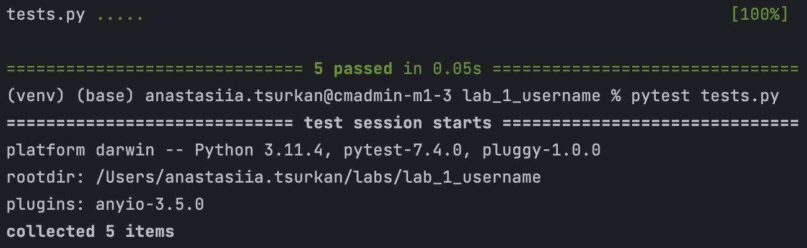

# Lab_1_username

Ознайомся з правилами встановлення і запуску проекту: 
[Інструкція](https://docs.google.com/document/d/1jHZogGJMYTCvN9Sp9LHqofXA2w5t9sGsEdBk-f5Cjwk/edit?usp=sharing)


Давай створимо программу, яка перевіряє чи відповідає введений username всім вимогам сайту. Ми маємо такі вимоги:
1. Довжина username повина бути від 3 до 15 знаків включно.
2. Не повино міститись ! та @.

Для виконання використовуйте умовний вираз `if/else`.
Якщо всі умови виконуються, треба вивести в термінал: <br>
#### "Username is valid". <br>
Якщо не виконується, хоч одна з зазначених вимог: <br>
#### "Please, enter username from 3 to 15 characters and don't use ! or @". <br>
Повідомлення мають бути самі такі, буква до букви, то просто скопіюй і встав, щоб не помилитись ;)

Щоб зробити перевірку на довжину використовуй функцію `len()` та оператори порівняння (`>, <, >=, <=`).
Щоб поєднади декілька умов використовуй логічний оператор `and`.
Щоб зробити перевірку на числа і букви, можна перевірити чи є не містяться в username такі знаки (! та @)

### НЕ змінюй цей файл і інші крім, вноси зміни тільки в main.py файл!!

Перевір свій код, в терміналі запусти: 
```
pytest tests.py
```
Якщо ти отримав повідомлення:

Можеш зберігати та відправляти своє рішення, як в інструкції. Якщо хоч один тест не пройшов, в тебе помилка в коді, будь ласка виправ її.
